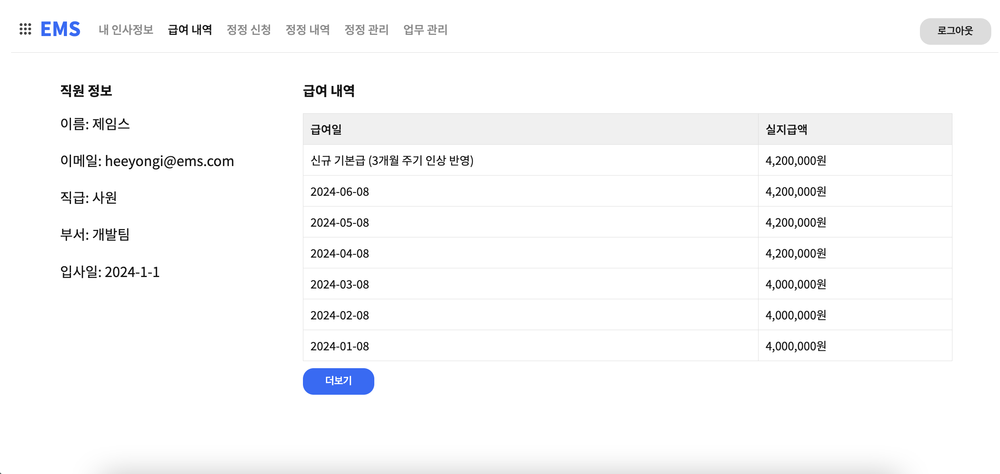

# 직원 관리 시스템 Employee Management System

## 프로젝트 개요

EMS를 통해서 직원은 본인의 급여 내역을 확인할 수 있고, 정정 신청 페이지에서 급여에 누락된 부분을 신청할 수 있습니다. 캘린더에서 여러 일정을 색으로 구분해서 표시하고, 해당 일정을 수정, 삭제할 수 있습니다.

#### <u>프로젝트 기간</u>

2024년 5월 27일 - 6월 9일

#### <u>배포링크</u>

https://deploy-preview-6--toy2-group3.netlify.app/

## 토이프로젝트2 3조 소개

<strong>김상화</strong> (https://github.com/Iam-Sanghwa/) 
개발 환경, Routing, Hook, Redux 설정, 프로필
  
<strong>김송희</strong> (https://github.com/lunatokki) 
로그인, 회원가입
  
<strong>김여진A</strong> (http://github.com/Yeojin-Kim12) 
헤더 및 캘린더
  
<strong>김희용</strong> (https://github.com/scripto1) 
급여 내역, 정정 신청, 정정 확인, 정정 관리
  

## 기술 스택

   
  

 
 proptypes

## 각 페이지 설명

### A. 개발 환경, Routing, Hook, Redux 설정 (김상화)

**구현 내용**

1. Routing

- Private/Public Routing을 활용한 로그인 여부에 따른 페이지 라우팅 분리
- useLocation을 활용한 리다이렉션 처리

2. Custom hook

- useAuth, useUser, useWork 등 Firebase 입출력 로직 작성
- 로그인 유지를 위해 login정보를 useAuth에서 처리할 때 LocalStorage에 저장, 로그아웃시 localStorage에서 삭제
- redux를 활용하여 상태관리 구현

3. Redux

- store.ts 및 slice(authSlice, userSlice, workSlice) 구현(workSlice 내 오류가 몇가지 있어서 해결해야합니다..)
- 파이어베이스 업로드/다운로드 등 통신 관련 상태 처리(진행중/진행완료/실패)
- createAsyncThunk를 활용한 비동기처리 및 에러처리

4. profile page구현
   - Profile page내 프로필정보(사진 및 개인정보) 표시
   - Profile 사진 변경 기능 추가
   - 데이터 로딩 애니메이션 구현

**회고**

1. 좋았던 부분

- redux와 같은 상태관리를 처음 접해보고 활용해본 것
- page layout작업을 선호하지 않는데,, 로직(?)위주로 작업한 것

2. 아쉬웠던 부분

- 어쩌다보니 page layout을 만지는 경우가 너무너무 적어서,, 아쉬움이 남는다
- 아직 redux에 대한 이해도가 높지 않은건 확실한 것 같다.. 어떤 오류가 발생했을 때 해결하는데 시간이 너무 오래걸리고, 여러차례 반복적으로 동일한 오류가 발생했던걸 보아 리팩토링을 통해 다시 코드를 작성해볼 필요가 있을 것 같다
- 지난 프로젝트에서는 CRA로 작업을 해서 그런지,, 마주하지 못한 오류가 많았다. netlify배포 중 build와 관련된 오류나, 환경변수(.env파일) 지정 문제 등등,, vite와 CRA로 프로젝트를 구성할 때 차이점을 정리할 필요가 있을 것 같다
- npm....... npm관련된 오류가 너무 많았다. git으로 package.json과 package-lock.json을 관리하고, git igonre에 Node_modules를 추가했는데도 불구하고 팀원들과의 협업과정에서 해당 파일들에서 충돌이 너무 많이 발생했다.. 삭제/재설치로 문제를 해결하기보다,, 어떻게든 이해해서 풀어내고싶었는데, 아무리 찾아도 원인을 모르겠어서 그냥 Node_modules, package-lock.json을 삭제하고 재설치했다..

3. 다음 프로젝트에서는..?

- 프로젝트 초기에 필요한 데이터와 데이터베이스를 좀 더 잘 구조화해서(다음엔 백엔드가 있으니까 괜찮으려나?ㅎㅋ) 한번에 큰 그림부터 작은 그림으로 그려나가는 프로젝트를 해보고싶다.
- 역할분배에서 페이지 레이아웃을 짜는 역할도 도맡아서 해봐야겠다
- 프로젝트 시작 전에 리덕스 등 상태관리툴에 대한 이해를 조금 더 높이고,, 반환 타입 등등에 더 신경써서 양질의 코드를 만들고싶다.

### B. 로그인, 회원가입 (김송희)

**1. Login, 회원가입 기능 구현**

- Google 로그인, 자체로그인 구현(이메일/비번)
- 회원가입 시 직원의 이메일, 비밀번호, 비밀번호 확인, 이름, 직급, 부서, 입사일, 프로필 이미지 등의 필수정보를 입력하도록 함.
- 회원가입완료, 로그인했을 때 헤더의 '내 인사정보'에서 본인의 프로필을 확인할 수 있음
- 헤더의 로그아웃버튼을 누르면 로그아웃되며 로그인 페이지로 돌아옴.

**2. 느낀 점**

- 이전 프로젝트에서도 Firebase를 사용했지만 세팅을 직접 해본 건 이번이 처음이었다. 좀 더 자세하게 알아가는 기회가 되어서 좋았다.
- 타입스크립트를 능동적으로 활용하지 못했던 게 아쉽다. 매번 프로젝트와 과제를 할 때 느끼는 부분이지만 짜여진 코드를 참고하는 것보다 직접 만들어보면서 배우는 과정이 꼭 필요하다는 생각이 들었다. 다음에는 훅이나 슬라이스를 스스로 만들어보고 싶다.
- 마음이 급해서 오류가 생기거나 막히는 부분이 안 풀리면 쉽게 탈력감을 느끼고 미루거나 생활패턴을 잘 조절하지 못했던 것이 아쉽다. 다음에는 집중할 때 집중하고 쉴 때 쉬는 방향으로 잘 이끌어가고 싶다.

### C. 헤더 및 캘린더 (김여진A)

**1. Header**

- 각 페이지로 이동할 수 있는 Header 구현

**2. Calendar**

- 사용자에 맞게 캘린더를 제공하는 페이지 구현
- 해당 날짜를 클릭하면 일정을 저장할 수 있는 modal 창이 뜸
- 일정의 title, startDate, endDate, color를 지정할 수 있음
- 이전 달이나 다음 달의 날짜를 클릭하면 달력이 변경됨
- 캘린더에 사용자의 일정이 출력되며 일정을 누르면 modal 창이 뜨며 읽기, 수정, 삭제 기능 가능

**3. 느낀점**

- 캘린더를 작업하면서 이래서 다들 라이브러리를 사용하는 건가..? 라는 생각을 잠깐 했습니다... div를 사용해서 그런지 일정의 위치에 대한 문제가 발생했는데 그 부분에 많은 시간을 쏟아서 시간이 부족한 점 등의 아쉬운 점이 많았습니다. 그래도 라이브러리를 사용하지 않고 캘린더를 만들어 본 것에 대해서 뿌듯함을 느꼈습니다.
- 타입 스크립트를 사용하긴 했지만 타입 스크립트의 장점을 잘 활용하지 못한 것 같아서 아쉬웠습니다. 하지만 사용하면서 타입을 생각하지 않았던 부분에서 타입에 대해 생각할 수 있게 되어 좋았습니다. 다음에 사용하게 된다면 장점을 더 활용하는 방안으로 코드를 작성하고 싶습니다.
- 리덕스랑 훅에 대해 공부가 부족하다는 것을 느꼈습니다. 공부가 부족한 만큼 코드 작성에 어려움을 많이 느꼈고 리덕스와 훅을 더 활용해 보고 싶었지만 많이 활용해 보지 못한 것 같아서 아쉬웠습니다.
- npm 관련 문제가 매번 발생해서 아쉬웠습니다. 파일을 받아올 때 node_modules에서 충돌이 매번 일어나서 삭제하고 재설치 하는 등으로 문제를 해결하였으나 이 방법으론 해결이 되지 않아 매번 어려움을 겪어서 아쉬웠습니다.

### D. 급여 내역, 정정 신청, 정정 확인, 정정 관리 (김희용)

**1. 급여내역**

- 현재 나의 급여를 확인할 수 있는 페이지를 구현했습니다. 로그인하면 해당 직원의 정보가 ‘내 인사정보’에 표시되고, ‘직원 정보’ 항목은 ‘내 인사정보’ 컴포넌트를 재활용했습니다.
- 최근 3개월 급여 내역을 확인할 수 있고, 더보기 버튼을 클릭하면 최대 10개월 급여 내역을 볼 수 있습니다. 회사 입사일을 기준으로 급여가 3개월에 5%씩 인상하도록 로직을 구성했습니다.
- 원래 계획은 급여 인상 내용을 막대 그래프로 표현하려고 했지만 미처 구현하지 못해 아쉽습니다.

**2. 정정 신청 / 정정 내역 / 정정 관리**

- ‘연장 근무’, ‘무급 휴가’, ‘휴일 근무’ 중에서 정정이 필요한 항목을 선택한 후 시작 날짜, 종료 날짜, 시작 시간, 종료 시간을 설정할 수 있습니다. 시간 설정이 필요 없는 ‘무급 휴가’를 선택하면 시간을 설정하는 입력창은 보이지 않도록 구현했습니다.
- ‘신청’ 버튼을 클릭하면 예상 수당 금액(시간당 5만원 씩 계산)을 확인할 수 있습니다. useWork 커스텀 훅을 통해 예상 수당을 받아 오고, 리덕스 workSlice를 이용해서 정정 사항을 비동기로 처리합니다.
- 정정 내역 페이지에서는 filter 메소드를 사용해서 로그인 한 직원의 이메일을 확인하고, 확인이 되면 해당 직원이 올린 정정 내역만 확인 할 수 있습니다.
- 정정 관리 페이지에서는 정정을 신청한 모든 내역을 확인 할 수 있고, ‘승인’, ‘반려’ 조치를 클릭하면 해당 내용이 정정 내역 페이지에 반영됩니다. 정정 조치를 ‘팀장’ 직급만 관리할 수 있도록 해당 페이지를 노출시키는 기능을 추가로 작업할 예정입니다.

**3. 스타일 작업**

- 스타일 수정흰색 바탕에 파란색과 회색을 포인트 컬러로 사용하였고, UI 라이브러리를 사용하지 않고 styled-component로 UI를 스타일했습니다. - 폰트, GlobalStyle을 지정하고, 공통으로 사용하는 버튼을 만들어서 재활용했습니다.

**4. 토이 프로젝트를 진행하면서 느낀점**

- 이번 프로젝트를 진행하면서 이전 프로젝트에서 다루지 못했던 파이어베이스를 공부할 수 있었습니다. 데이터를 가져와서, 업데이트하고 다시 저장하는 과정을 통해 프론트엔드와 서버 사이의 통신이 어떻게 이루어지는지 어렴풋이 알게 되었습니다.
- 비동기 통신에 필요한 기능을 따로 저장한 커스텀 훅도 간단하게 만들어 볼 수 있었습니다. 같은 팀의 상화님이 프로젝트 전체의 커스텀 훅을 잘 만들어 주셨고, 프로젝트에 적용하면서 리액트 훅의 편리한 기능도 알 수 있었습니다.
- 리덕스와 리덕스 툴킷을 여러 자료를 통해서 공부했지만 아직 완벽히 이해하지 못해서 아쉽습니다.
- chat-GPT에 많이 의존하고 있는데, 남은 부트캠프 기간 동안 자바스크립트와 리액트를 심도있게 공부해서 GPT 의존도를 낮추려고 합니다.
